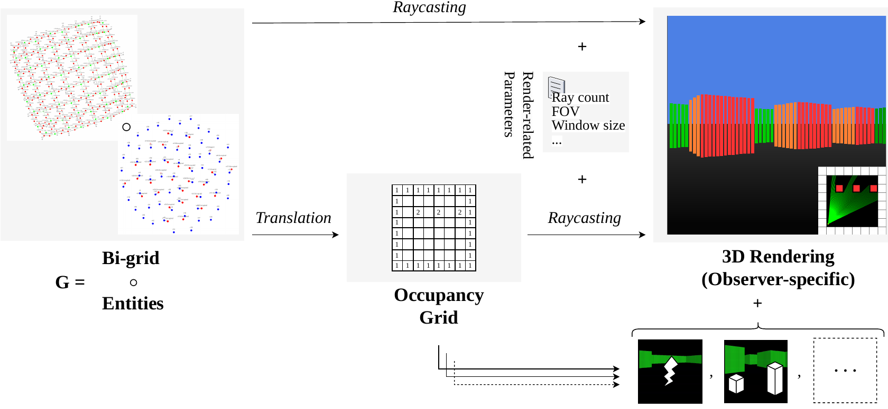

# Bigrid Raycasting Visualizer

A research prototype for real-time 3D visualization of cyber-physical system states represented as spatial bigraph models. 
It uses a raycasting-based renderer and was developed for the [user study](https://doi.org/10.5281/zenodo.23117795) of the paper "Interactive Raycasting-Based Visualization for Spatial Formal Models".



## Requirements

- JDK 21
- Maven 3.8 or later
- An OpenGL-capable graphics environment

The supplied Maven configuration uses Linux LWJGL native libraries. 
The build and Docker instructions below therefore target Linux.

## Build and Run

Clone the repository, build the application, and launch the generated JAR:

```bash
$ git clone https://github.com/bigraph-toolkit-suite/bigraphs.model-raycaster.git
$ cd bigraphs.model-raycaster
$ mvn clean package
$ java -jar target/bigrid-raycaster.jar
```

Maven resolves the application dependencies, including LWJGL, during the build.

## Docker Demo

The Docker image expects the JAR and the `assets/data` directory to be present in the repository. 
Build the application first, then build and run the image:

```bash
mvn clean package
docker build -t bigrid-raycast-demo .
mkdir -p /tmp/docker-xdg
docker run --rm -it \
  --gpus all \
  --ipc=host \
  --env DISPLAY="$DISPLAY" \
  --env XDG_RUNTIME_DIR=/tmp/docker-xdg \
  --env NVIDIA_DRIVER_CAPABILITIES=graphics,display,utility \
  --volume /tmp/.X11-unix:/tmp/.X11-unix:rw \
  --volume /tmp/docker-xdg:/tmp/docker-xdg \
  bigrid-raycast-demo
```

The container is run with NVIDIA GPU support.
Your host's X11 access-control settings must permit the container to connect to the display - use `xhost -local:root`.

## Usage

### Visualizing Transition System Traces

The visualizer displays simulation traces generated with the [Bigraph Framework](https://github.com/bigraph-toolkit-suite/bigraphs.bigraph-framework). 
Place the trace files in the `assets/data` directory used by the application and ensure its configured data path points to that location.
Trace files must use the `.xmi` extension. 
The application orders the files by name to reflect the intended simulation sequence.

The grid dimensions must also match the model being visualized. 
In `BigridRaycasterApp.java`, adjust `mapX` to the number of columns and `mapY` to the number of rows. 
For example, the SSR-2x4 model uses a 2×4 bi-grid, so both values should be set to:

```java
final int mapX = 4, // Number of columns in the map grid
        mapY = 2;   // Number of rows in the map grid
```


The traces are then loaded step by step:

- Use <kbd>W</kbd>, <kbd>A</kbd>, <kbd>S</kbd>, and <kbd>D</kbd> to move the camera.
- Press <kbd>N</kbd> to advance the simulation by one step.


Note that the visualizer can be run in manual mode using the `initMap` variable in `RaycastingVisualizerApp.java`. 
Comment out the trace-based `initState()` implementation and uncomment the other variant of this method below it. 
Adjust `initMap`, `mapX`, and `mapY` to match the desired grid dimensions; `secondaryMap` can optionally be adjusted for additional cell overlays.

## License

Copyright 2026 Dominik Grzelak

This project is licensed under the [Apache 2.0 license](LICENSE.txt).

